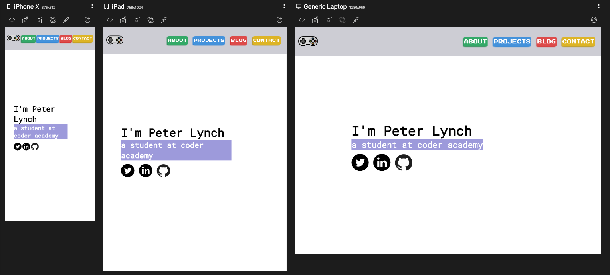
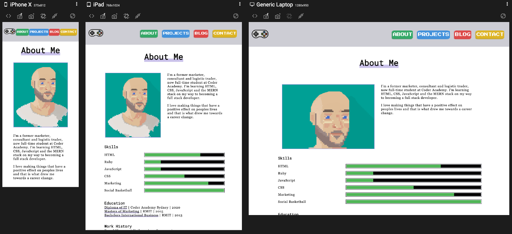
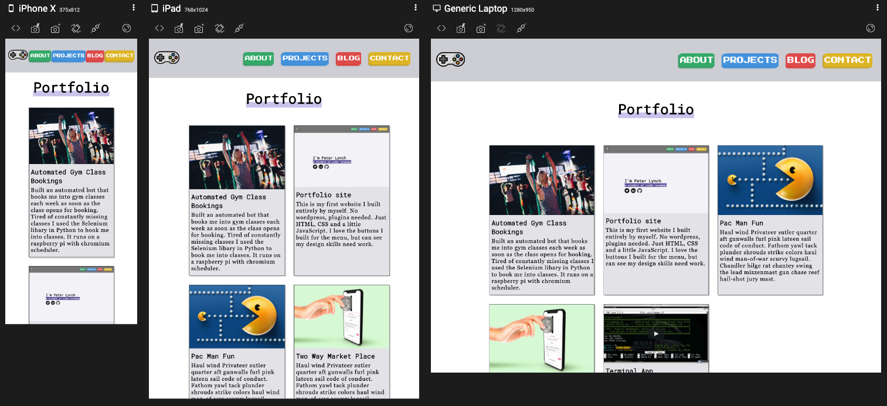
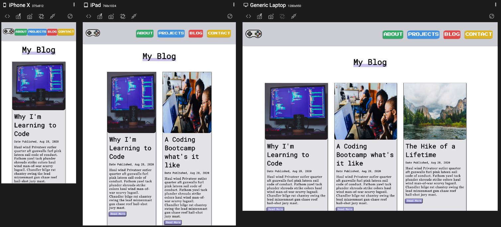
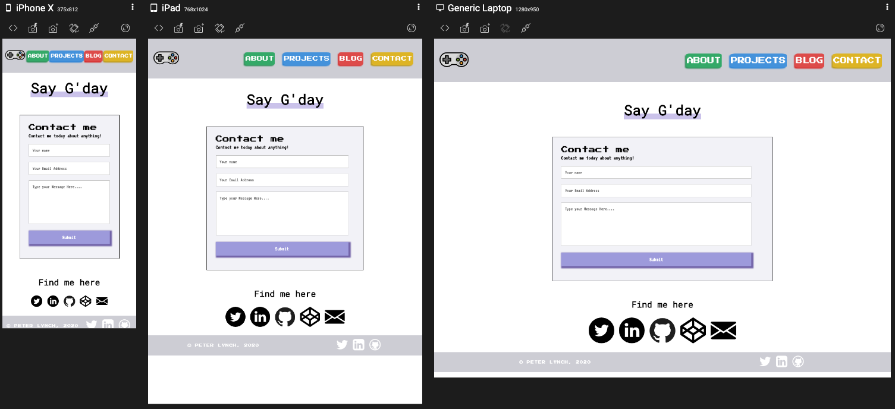
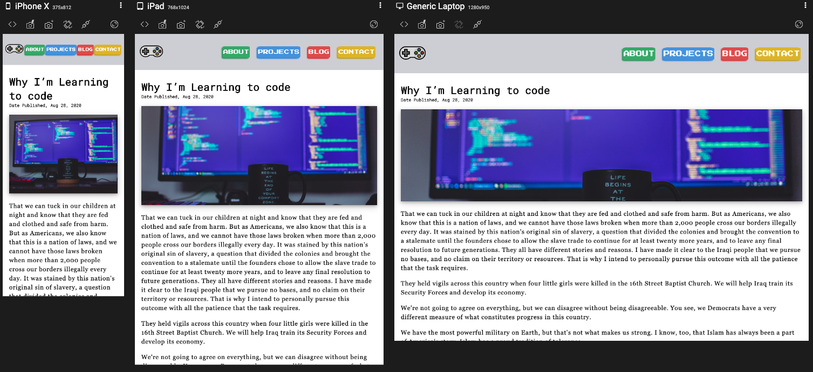

Links
------
Portfolio URL deployed on Netlify [here](https://peter-lynch.netlify.app/index.html) 
Ed Workspace [here](https://edstem.org/courses/4464/workspaces/pKAuXdXPXw4xGq6gGQwV83bfVxRoiQsc) 

Purpose
------
The purpose of this portfolio website was to make it as easy as possible for potential employers to understand who I am, what work I have done, my skills and how I can contribute to their business success.

This website contains several methods of contact, projects I’ve completed, blog posts I’ve written and personal information about me. I also wanted to use this website to demonstrate my understanding of the balance between design and function.

Functionality and Features
------
The website follows what I like to call the mullet style (party up top, business down below). I wanted the site to have fun features up top like the navigation bar that were enticing to the target audience and some nicely styled elements like the buttons, images and hover effects. However, I was most aware that the site needed to be functional. Meaning it is easily readable, easy to navigate and accessible.

### Functionality
The key aspects of the site that were designed with functionality in mind were.
- Accessibility
    -Fonts that are easy to read: headings (Roboto Mono), paragraphs (Georgia).
- Alt text for all images.
- Links - open in a new tab to keep users on my site.
- Mailto - allow users to easily contact me with prefilled address and subject line.
- Responsive, mobile first design using flexbox and grid.
- Navigation - all key parts of website easily accessible by navbar.

### Features
Features were the fun part designed to show off some of my coding ability and to key the website some wow factor.
- Animations
    - Used animations to make button push effect, draw users eyes to certain parts of the site and entice users to learn more about me.
- Hover effects on project cards.
- Contact form.
- Skill bars with sweet animations.
- Carousel of quotes from friends and ex-employers.
- Clean landing page with animations to quickly show who I am and why you should be interested in me.

Sitemap
------

Screenshots
------
#### Homepage

#### About page

#### Projects

#### Blog

#### Contact

#### Blog post

Mobile screenshots: [here](docs//Mobile-screenshots) 
iPad screenshots: [here](docs//iPad-screenshots) 
Desktop screenshots: [here](docs//Desktop-screenshots) 

Target Audience
------
The target audience for my website is potential employers in particular the hiring manager and human resources people. This website allows this target audience to understand who I am and am I a good cultural fit(about page), am I capable of doing the job (projects page), what interests me (blog and about) as well as allowing them to easily contact me on several
platforms.

Tech Stack
------
The technology I used to create this website was: 
HTML (main structure of page) 
CSS (responsive design and styling) 
JavaScript (Carousel element on about page) 
Balsamiq (wireframing) 
Git (version control) 
Github (remote version control) 
Google Fonts 
Responsively.app (check responsiveness/screenshots) 
Draw.io (sitemap) 
